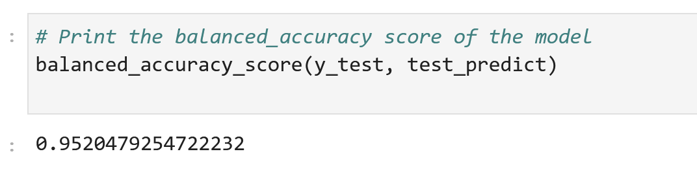
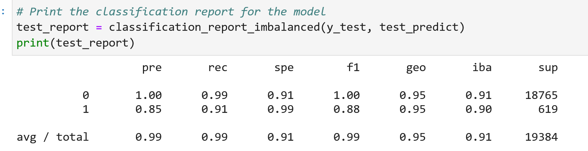
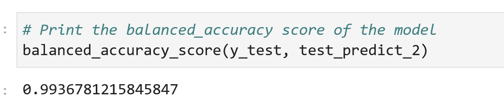
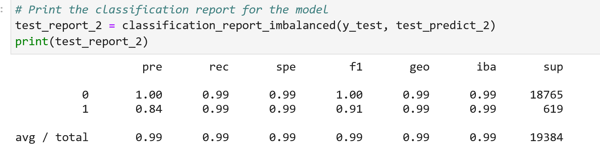

<div id="top"></div>
<br />

<h3 align="center">Credit Risk Classification</h3>

  <p align="center">
  The credit risk classification program uses machine learning to train models that can identify the creditworthiness of borrowers.  
    <a href="https://github.com/jtengsico/12-Supervised-Learning.git">
  </p>
</div>

<!-- TABLE OF CONTENTS -->
<details>
<summary>Table of Contents</summary>
  <ol>
    <li><a href="#about-the-project">About The Project</a>
    <li><a href="#built-with">Built With</a></li>
    <li><a href="#installation">Installation</a></li>
    <li><a href="#overview-of-analysis">Analysis</a></li>
    <li><a href="#conclusion">Conclusion</a></li>
    <li><a href="#license">License</a></li>
    <li><a href="#acknowledgments">Acknowledgments</a></li>
  </ol>
</details>

<!-- ABOUT THE PROJECT -->
## About The Project
One of the issues with creating machine learning models for credit risk identification is that there are more healthy loans than risky ones. This causes an imbalance with the model being more accurate for the class (healthy loans) that has more data. So we use imblearn and logistic regression models to deal with this issue. The outcome of the program is that we have created a model that can identify the creditworthiness of borrowers with high precision.

<p align="right">(<a href="#top">back to top</a>)</p>

### Built With
* python 3.7 
* numpy 
* pandas 
* pathlib 
* scikit-learn
* imbalanced-learn

<p align="right">(<a href="#top">back to top</a>)</p>

<!-- Installation -->
### Installation 

To setup this program on your desktop, follow the steps below.
1. Clone the repo
   ```sh
   git clone https://github.com/jtengsico/12-Supervised-Learning.git
   ```
2. Install required python packages listed in the Built With section. 
3. In your terminal, navigate to the correct folder and enter jupyter lab to launch it in your browser.

<p align="right">(<a href="#top">back to top</a>)</p>

<!-- Overview of Analysis -->
## Analysis

1. In the first steps, we have to train the model with our original data and analyze those results. 
2. We take the historical CSV lending data and make it into a pandas dataframe. 
3. Then we read the data and separate the y and X variable. 
4. We then split the data and fit it into a logistic regression model. 
5. We save the data and then read the report which shows high accuracy but prediction for unhealthy loans is at 85% and recall is at 91% while prediction for healthy loans is at 100%. This is due to the imbalance between classes. 
6. In the 2nd part, we use imbalance-learn (imblearn) to resample the data and make the classes have a equal number of data points. 
7. We then fit the data to the model and review the performance. 
8. In this model, we can see that prediction for unhealthy loans has gone down to 84% but the recall has gone up to 99%.

* Machine Learning Model 1:
  Accuracy
  

  Precision and Recall
  


* Machine Learning Model 2:
  Accuracy
   

  Precision and Recall
   

<p align="right">(<a href="#top">back to top</a>)</p>

<!-- conclusion -->
## Conclusion
The performance of the model depends on what we are trying to do and in this case we are trying to identify the risky borrowers. So, although the precision of the 2nd model is 84% and less than the 1st model, the 2nd model is better becaues it accurately identifies risky loans (recall of 99%). 

<p align="right">(<a href="#top">back to top</a>)</p>

<!-- LICENSE -->
## License

Distributed under the MIT License.
See [license txt](https://github.com/git/git-scm.com/blob/main/MIT-LICENSE.txt)

<p align="right">(<a href="#top">back to top</a>)</p>

<!-- ACKNOWLEDGMENTS -->
## Acknowledgments
Credit to creator of readme template. The repo also has useful resources. 
* [README Template](https://github.com/othneildrew/Best-README-Template.git)

<p align="right">(<a href="#top">back to top</a>)</p>
